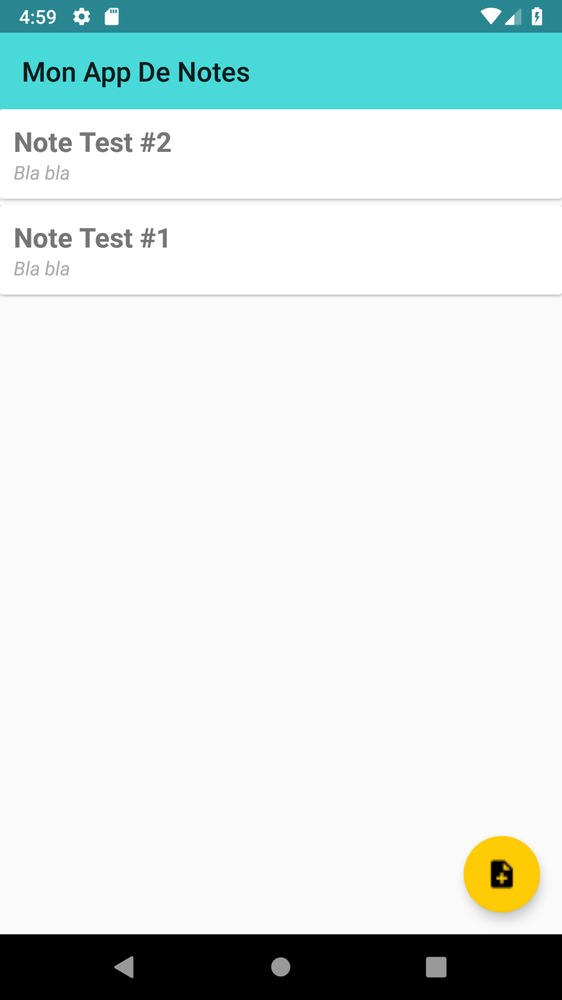

# MyNotesApplication
Simple To-Do Android app with Kotlin.

## Previews
{:height="50%" width="50%"}
{:height="50%" width="50%"}
{:height="50%" width="50%"}

## Links

- [Material icons](https://material.io/tools/icons/?style=baseline)